# Sprat-gui

Sprat-cli frontend, to generate spritesheets and related metadata (ex: animations and hitboxes).

Use this app if you need to:

1. Build sprite sheet layouts from a folder of images.
2. Edit pivots and markers per sprite visually.
3. Create animation timelines quickly from frame naming patterns.
4. Preview and export animations (GIF/video) without manual scripting.
5. Save/load complete project state (`.json` or `.zip`).

If your workflow is already fully automated by scripts and CI, this may be unnecessary. If you need fast visual iteration for game/UI assets, this is likely useful.

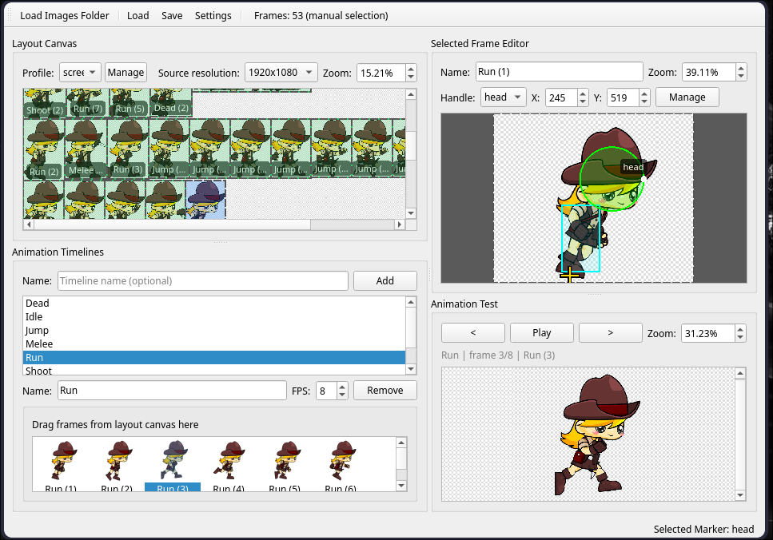

## What it does (and why you might need it)

- **Layout generation (spratlayout integration)**  
  Generates atlas layout data from your image folder, so you avoid hand-maintained packing metadata.

- **Sprite editing (pivot + markers)**  
  Lets you place gameplay/UI anchors directly on frames, reducing downstream guesswork in engine integration and capturing marker positions for collision zones or entity spawn points (e.g., muzzle origins for bullets).

- **Timeline authoring**  
  Supports manual frame ordering and automatic timeline generation from names like `Run (0)`, `Run (1)`, etc.

- **Animation test panel**  
  Play/step through timelines with FPS and zoom controls to validate motion before export.

- **Animation export**  
  Exports to GIF (ImageMagick) and video formats (FFmpeg) for quick validation and sharing.

- **Project persistence**  
  Save and load full project state (layout options, markers, timelines) to continue work later.

- **CLI tools configuration/installation UI**  
  Configure binary paths in Settings or install required CLI tools from the app.

## Requirements

- Qt 6 (Core, Gui, Widgets, Concurrent)
- CMake >= 3.16
- C++17 compiler
- Sprat CLI tools:
  - `spratlayout`
  - `spratpack`
  - `spratconvert` (optional for format transforms)
  *(If the app detects them missing it can run the bundled installer and drop binaries into `~/.local/bin`.)*
  - If you already have the `sprat-cli` repository checked out as a sibling to this project (for example `../sprat-cli`), build that copy and the GUI will automatically pick up `spratlayout`, `spratpack`, and `spratconvert` from it or let you point Settings directly at those binaries.
- Optional export tools:
  - ImageMagick (`magick` or `convert`) for GIF
  - FFmpeg (`ffmpeg`) for video
- Optional archive tools:
  - `zip` (save `.zip` projects)
  - `unzip` (load `.zip` projects)

When the installer downloads the CLI tools for you, it clones the latest `main` version of `sprat-cli` (`git clone --depth 1 --branch main https://github.com/pedroac/sprat-cli.git`) before building them, ensuring you always get the up-to-date release branch.

## Local CLI development

Place the `sprat-cli` repository beside this project (for example, at `../sprat-cli`) so the GUI can work with the same source tree. After building that repo (e.g., `cmake -S ../sprat-cli -B ../sprat-cli/build && cmake --build ../sprat-cli/build`), Sprat GUI auto-detects the generated `spratlayout`, `spratpack`, and `spratconvert` binaries, or you can point the Settings dialog at the directory. If you clone manually (or let the installer do it for you), make sure to pull the latest `main` branch before building so the GUI uses the most current CLI behavior.

## Manual frame editing

Use the layout canvas context menu to manage individual frames without reloading an entire folder. Right-click an empty area, choose **Add Frames...**, and pick one or more image files. The GUI writes a temporary plaintext list that `spratlayout` already understands (the same list-file input described in the [`sprat-cli`](https://github.com/pedroac/sprat-cli) README) and runs the layout using that list, so you can mix files from anywhere on disk. Right-clicking a selected sprite (or selection) exposes a **Remove Frame** / **Remove Frames** command; if any of the chosen frames are referenced by existing timelines you are warned that the timelines will drop those entries before the removal proceeds.

## Build

```bash
cmake .
cmake --build . -j4
```

Binary output:

```bash
./sprat-gui
```

## Quick start

1. Launch the app.
2. Open **Settings** and verify CLI tool paths (or use install action).
3. Click **Load Images Folder** and select your frames directory.
4. Adjust layout options (profile/padding/trim).
5. Select sprites to edit pivots/markers.
6. Create timelines manually or generate from frame names.
7. Test animation in the Animation panel.
8. Save project (`.json` or `.zip`) or export animation.

## UI workflow

- **CLI Tools / Settings**
  - On first launch the toolbar shows “CLI missing”; click Settings to point to `spratlayout`, `spratpack`, and optionally `spratconvert`, or use the “Install CLI Tools” button to download/build into `~/.local/bin`.
  - Settings also exposes canvas/marker colors and border styles that apply immediately and persist.
  - 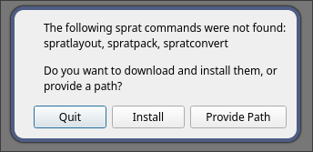

- **Loading frame folders**
  - Use the “Load Images Folder” toolbar action or drop a directory/ZIP/project file onto the window.
  - The layout canvas lists all frames; search the frame list by name to filter sprites for quicker edits.
  - Adjust profile/padding/trim controls, zoom/scroll the canvas, and move the viewport with scrollbars or mouse drag. Clipboard cut/copy/paste works while managing frames.
  - 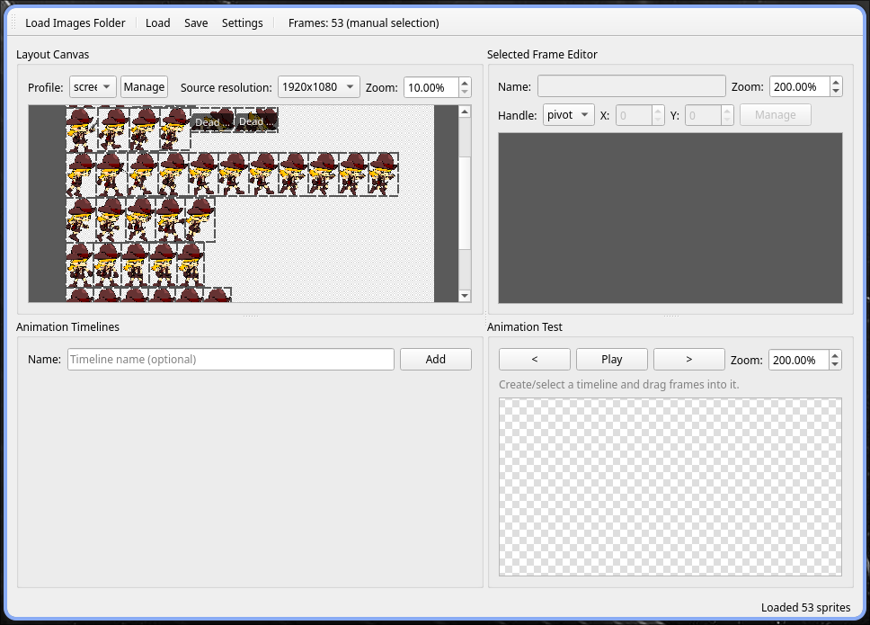
  - 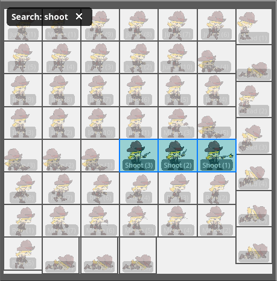

- **Sprite sheet layout editing**
  - Select a sprite to see its preview details; use zoom/scroll controls inside the preview canvas.
  - Rename the sprite, adjust its pivot (X/Y spins), or switch between markers (point/circle/rectangle/polygon) via the handle dropdown.
  - Markers show handles for precision; add/edit points, circles, rectangles, or polygons using the markers dialog and context menus—marker info is also copied to clipboard.
  - 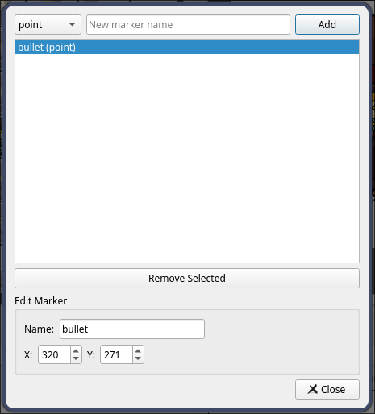
  - 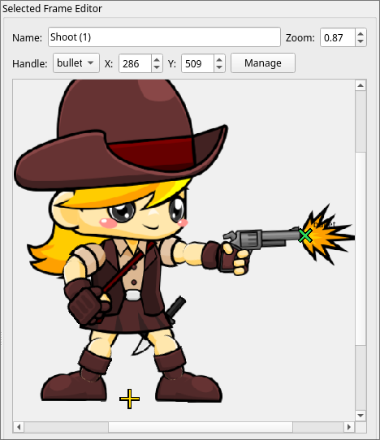
  - 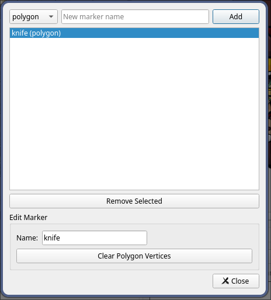
  - 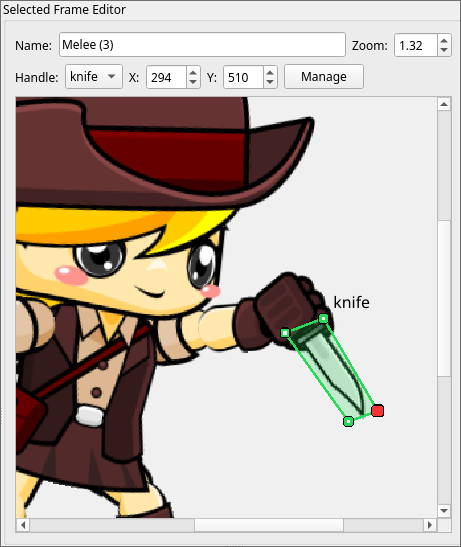
  - 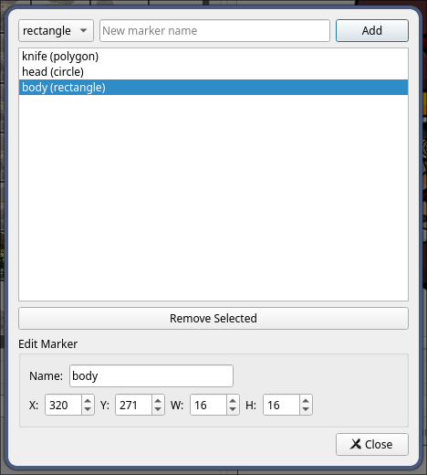
  - 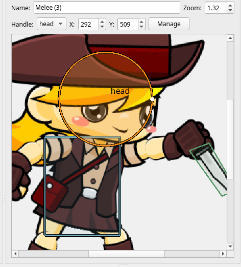

- **Animation authoring**
  - Timelines panel lets you add simple names, remove, rename, and select timelines.
  - Drag frames from the layout into the timeline list; reorder via drop or context actions; duplicate/remove frames with toolbar buttons.
  - Animation test area exposes play/pause/step controls plus FPS and zoom sliders. Use “Save Animation…” (right-click preview) after choosing ImageMagick/FFmpeg toolchains. 
  - 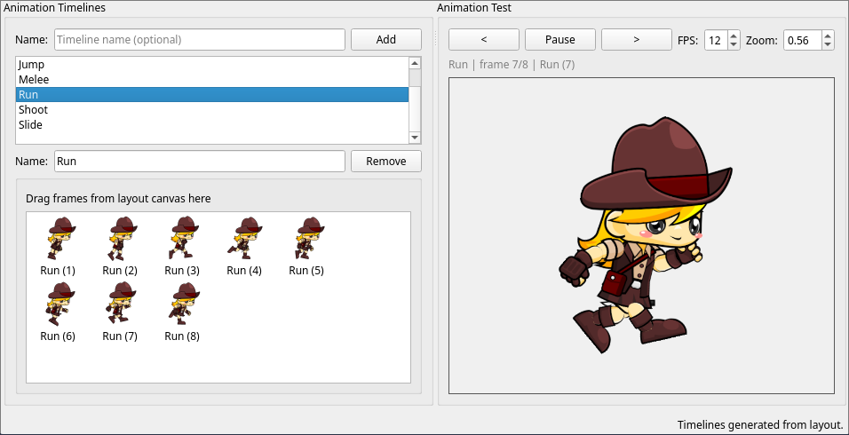

- **Project persistence**
  - Save writes layout, markers, timelines, and export configs to `.json` or `.zip` via the Save dialog.
  - Load restores saved projects (including ZIP archives) while reapplying layout options, selected timelines, and markers.
  - 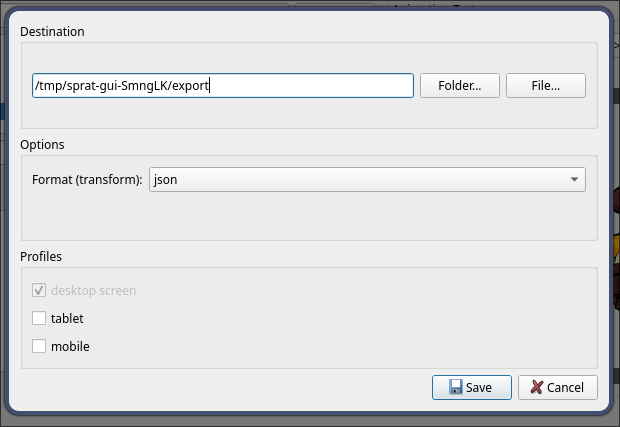

## Timeline auto-generation naming

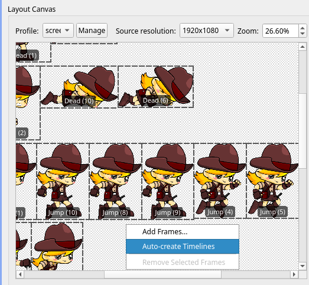 

Expected pattern:

```text
<Name> (<Index>)
```

Examples:

- `Idle (0)`, `Idle (1)`, `Idle (2)`
- `Run (0)`, `Run (1)`, `Run (2)`

Generation behavior:

- Creates timeline `<Name>` if it does not exist.
- Adds frames that start with `<Name>` and match the pattern.
- Sorts frames by `<Index>`.
- If a timeline exists, you can choose **Replace**, **Merge**, or **Ignore**.

## Project structure (high-level)

- `src/App/MainWindow/` — UI composition and event delegation
- `src/SpriteSheetLayout/` — layout canvas/parser/sprite model UI item
- `src/SelectedSpriteFrame/` — selected-frame preview/overlay/markers flow
- `src/Animation/` — animation playback/export logic
- `src/Animation/Timelines/` — timeline building and operations
- `src/Project/` — project load/save/payload/autosave
- `src/CLITools/` — CLI discovery/config/install helpers
- `src/Settings/` — settings dialog/coordinator
- `src/Core/` — shared models

## Troubleshooting

- **“CLI missing” at startup**  
  Open Settings and set absolute paths for Sprat binaries, or install them from the app.

- **Cannot save/load `.zip` project**  
  Ensure `zip`/`unzip` are installed and available in `PATH`.

- **Animation export disabled or failing**  
  Install ImageMagick and/or FFmpeg, then restart the app.

## Contributing

- **Report bugs**  
  Open an issue with reproduction steps, expected behavior, actual behavior, OS, and logs/screenshots when available.

- **Suggestions / feature requests**  
  Open an issue describing the workflow problem first, then proposed behavior and tradeoffs.

- **Pull requests**  
  PRs are welcome. Keep changes focused, include rationale, and add tests or manual validation notes for behavior changes.

- **Packages / binaries**  
  Contributions for distribution packages and CI release flows are welcome, including:
  - Debian/Ubuntu (`.deb`)
  - RPM-based distros (`.rpm`)
  - Windows binaries/installers
  - macOS app/bundles

- **Forks / alternative frontends**  
  Forks are encouraged (for example, a GTK+ frontend variant) as long as they clearly document compatibility and maintenance scope.

- **AI-assisted work**  
  Development on this project has been assisted with Codex and Gemini; all changes are reviewed and manually adjusted since AI output is not perfect.

## Attribution

- Screenshots using the “Adventurer Girl – Free Sprite” pack by pzUGH from OpenGameArt (https://opengameart.org/content/adventurer-girl-free-sprite), reused under the original license.
- Core CLI tooling comes from the [`sprat-cli`](https://github.com/pedroac/sprat-cli) repository.

## License

MIT. See [LICENSE](LICENSE).

## Support

[](https://buymeacoffee.com/pedroac)
