# Sprat-gui

GUI frontend for `sprat-cli` to generate spritesheets and related metadata (for example animations and hitboxes).

Use this app if you need to:

1. Detect individual frames in a single image automatically or manually.
2. Build sprite sheet layouts from a folder of images.
3. Edit pivots and markers per sprite visually.
4. Create animation timelines quickly from frame naming patterns.
5. Preview and export animations (GIF/video) without manual scripting.
6. Save/load complete project state (`.json` or `.zip`).

If your workflow is already fully automated by scripts and CI, this may be unnecessary. If you need fast visual iteration for game/UI assets, this is likely useful.

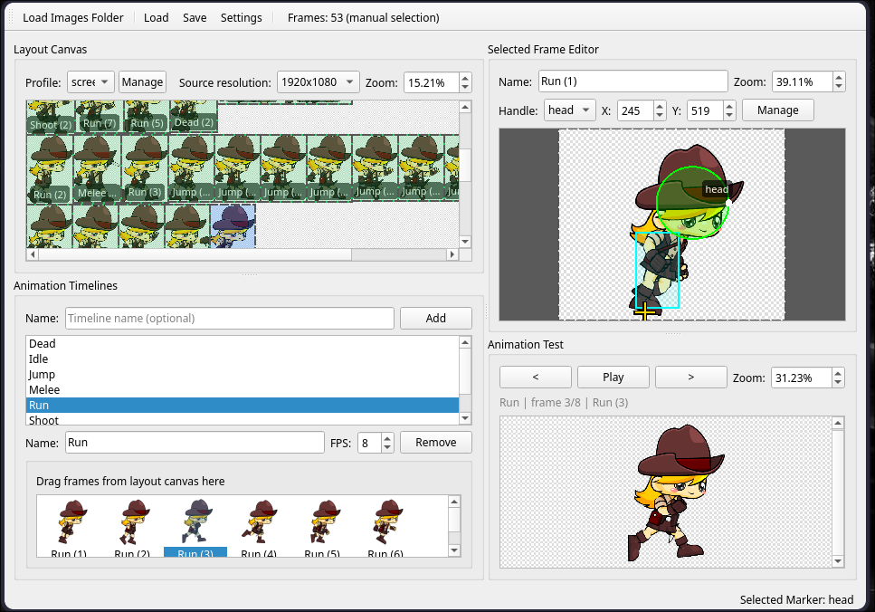

## What it does (and why you might need it)

- **Frame detection (spratframes integration)**  
  Automatically identifies individual frames in a sprite sheet or strip when you load a single image, with support for manual splitting and selection.

- **Layout generation (spratlayout integration)**  
  Generates atlas layout data from your image folder, so you avoid hand-maintained packing metadata.

- **Sprite editing (pivot + markers)**  
  Lets you place gameplay/UI anchors directly on frames, reducing downstream guesswork in engine integration and capturing marker positions for collision zones or entity spawn points (e.g., muzzle origins for bullets).

- **Timeline authoring**  
  Supports manual frame ordering and automatic timeline generation from names like `Run (0)`, `Run (1)`, etc.

- **Animation test panel**  
  Play/step through timelines with FPS and zoom controls to validate motion before export.

- **Animation export**  
  Exports to GIF (ImageMagick) and video formats (FFmpeg) for quick validation and sharing.

- **Project persistence & Autosave**  
  Save and load full project state (layout options, markers, timelines). The app automatically performs a background autosave every 5 minutes to prevent data loss.

- **Sources management**
  Load sprites from folders, archives (ZIP/tar), single images (including animated GIFs), or URLs. Use **Sync Source to Layout** to re-import changes from the original file, or **Sync Layout to Source** to write the current pivot/marker state back to the source without leaving the app.

- **Project synchronization**
  Sync your project with the source folder manually or via live file system monitoring (Watch mode) to pick up new or changed assets automatically.

- **CLI tools configuration/installation UI**
  Configure binary paths in Settings or install required CLI tools from the app.

- **Advanced output processing**
  Per-profile GPU texture compression (DXT1/DXT5), artifact reduction via pixel dilation, and sprite deduplication (Exact or Perceptual modes).

- **Visual customization**
  Customize workspace and sprite frame background colors, toggle transparency checkerboard, and configure sprite border styles.

## Requirements

- Qt 6 (Core, Gui, Widgets, Concurrent)
- CMake >= 3.16
- C++17 compiler
- Sprat CLI tools:
  - `spratframes`
  - `spratlayout`
  - `spratpack`
  - `spratconvert` (optional for format transforms)
  - libsquish (bundled in sprat-cli for DXT texture compression)
  *(If the app detects them missing it will offer to download and build them for you.)*
  - If you already have the `sprat-cli` repository checked out as a sibling to this project (for example `../sprat-cli`), build that copy and the GUI will automatically pick up `spratframes`, `spratlayout`, `spratpack`, and `spratconvert` from it, or let you point Settings directly at those binaries.
- Optional export tools:
  - ImageMagick (`magick` or `convert`) for GIF
  - FFmpeg (`ffmpeg`) for video
When the installer downloads the CLI tools for you, it clones the latest `main` branch of `sprat-cli` (`git clone --depth 1 --branch main https://github.com/pedroac/sprat-cli.git`) before building.

## Local CLI development

Place the `sprat-cli` repository beside this project (for example, at `../sprat-cli`) so the GUI can work with the same source tree. After building that repo (for example `cmake -S ../sprat-cli -B ../sprat-cli/build && cmake --build ../sprat-cli/build`), Sprat GUI auto-detects the generated `spratframes`, `spratlayout`, `spratpack`, and `spratconvert` binaries, or you can point the Settings dialog at the directory.

## Manual frame editing

Use the layout canvas context menu to manage individual frames without reloading an entire folder. Right-click an empty area, choose **Add Frames...**, and pick one or more image files. The GUI writes a temporary plaintext list that `spratlayout` already understands (the same list-file input described in the [`sprat-cli`](https://github.com/pedroac/sprat-cli) README) and runs the layout using that list, so you can mix files from anywhere on disk. Right-clicking a sprite exposes a **Remove Frame** action for the frame under the cursor; if that frame is referenced by existing timelines you are warned that timelines will drop those entries before removal proceeds.

## Try Online

**Web Demo:** No installation required!
- **[Sprat GUI Web Demo](https://sprat-gui.itch.io)** - Full app in your browser
- For full features (frame detection, GIF/video export), use the desktop version.

See [WASM_DEPLOYMENT.md](WASM_DEPLOYMENT.md) for deployment instructions.

## Build

### Linux / WASM

Default build (updates `DEPENDENCIES` from remote tags, configures, builds, then runs tests):

```bash
sh build.sh
```

`build.sh` behavior:
- Updates `DEPENDENCIES` to the newest published `sprat-cli` release tag if network access is available.
- Configures with `cmake -B build -S .`.
- Builds with `cmake --build build`.
- Runs tests with `ctest --test-dir build --output-on-failure`.

### Windows

A dedicated batch file is provided for Windows builds using Visual Studio or Ninja:

```cmd
build_windows.bat
```

This script:
- Configures the project with `SPRAT_EMBEDDED_CLI=ON` (the default for Windows).
- Automatically downloads `sprat-cli` source if not found locally.
- Builds the project in Release mode.
- Deploys Qt dependencies using `windeployqt`.
- Copies required assets (`spratprofiles.cfg` and `transforms/`).

On Windows, the application and its dependencies are placed in a `build/bin` directory. A `sprat.bat` launcher is created in the `build` root for convenience.

### Manual build

Manual build (does not modify `DEPENDENCIES`):

```bash
cmake -S . -B build -DSPRAT_EMBEDDED_CLI=ON
cmake --build build --parallel
ctest --test-dir build --output-on-failure
```

Run:

```bash
./build/sprat-gui
```

## Quick start

1. Launch the app.
2. Verify CLI tool paths in **Settings → CLI Tools** (the app prompts to install them if missing); optionally enable **Deduplicate identical sprites** in **Settings → Spritesheet**.
3. Click **Load Images Folder** and select your frames directory.
4. Adjust layout options (profile/padding/trim) and use **Manage Profiles** to configure per-profile output processing (GPU compression, artifact reduction).
5. Select sprites to edit pivots/markers.
6. Create timelines manually or generate from frame names.
7. Test animation in the Animation panel.
8. Save project (`.json` or `.zip`) or export animation; output format (PNG vs. DDS) depends on active profile compression settings.

For a guided introduction, open **Help → Quick Start** inside the app. For a full list of keyboard shortcuts, open **Help → Hotkeys**.

## UI workflow

- **CLI tools configuration / missing detection**
  - On first launch, if the required Sprat binaries are missing, the app displays a "CLI missing" status and prompts you to either point to existing binaries or download/install them automatically into `~/.local/bin`.
  - You can manually configure binary paths anytime in **Settings → CLI Tools**.
  - 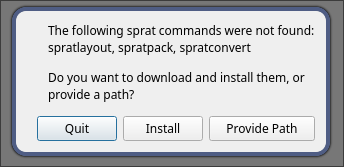

- **Visual customization & Synchronization**
  - **Styles**: Configure workspace and sprite frame background colors, toggle the transparency checkerboard, and set the color and style (Solid, Dash, etc.) of sprite borders in **Settings → Styles**.
  - **Synchronization**: Choose between **None**, **Manual** (sync on demand), or **Watch** (live file system monitoring) in **Settings → Spritesheet** to keep your project in sync with the source images folder.

- **Profile management with output processing**
  - Use **Manage Profiles** to create and configure layout profiles.
  - Each profile supports per-target output processing:
    - **GPU Compression**: Choose None, DXT1 (RGB, no alpha), or DXT5 (RGBA) for hardware texture compression. Output is saved as `.dds` when enabled.
    - **Dilate (Artifact Reduction)**: Apply pixel dilation passes (0–16) to bleed opaque pixels into transparent neighbors, reducing dark halos around trimmed sprites.
  - These settings are profile-specific; different targets can use different compression formats.
  - **Global Deduplicate**: Enable deduplication in Settings using **Exact** (byte-for-byte identical) or **Perceptual** (visually similar) modes to create aliases for duplicate sprites during layout generation.

- **Sprite Navigator**
  - Switch from **Layout** to **Navigator** view (above the atlas canvas) to see a hierarchical tree of all sprites organised by folder. Use `Alt+L` / `Alt+N` to switch quickly via keyboard.
  - Check sprites individually or by folder; right-click for context actions or press `Delete` to remove selected sprites:
    - Delete selected sprites.
    - Add frames to a folder.
    - Add checked sprites to the current timeline.
    - Create a new timeline from selected sprites.
    - Auto-create timelines from every sub-folder at once.
    - Group or ungroup sprites (moves files into subfolders).
  - When you switch back to Layout view, the atlas rebuilds if any changes were made while the Navigator was open.

- **Automatic layout rebuild**
  - The atlas rebuilds automatically 2 seconds after you stop making changes (adding, removing, or modifying sprites, changing the active profile or source resolution).
  - Deleting sprites removes them from the canvas immediately for instant visual feedback; the full repack runs in the background.
  - If 20 or more changes accumulate quickly, a full rebuild starts right away with a loading overlay.
  - While you are interacting with the layout (clicking, selecting, scrolling), the rebuild timer is deferred until you stop.
  - If a rebuild is already running when new changes arrive, it is cancelled safely and restarted after the 2-second pause.

- **Loading frame folders**
  - Use the “Load Images Folder” toolbar action or drop a directory/ZIP/project file onto the window.
  - When loading a ZIP with multiple image directories, the app prompts you to choose the folder to import.
  - 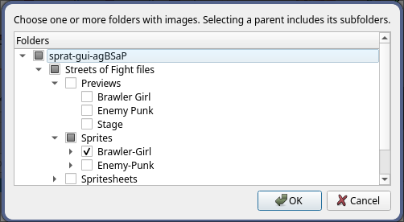
  - Use the profile selector to switch layout behavior, choose source resolution when needed, ...
  - 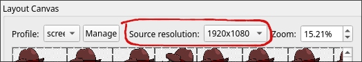
  - ... and use the **Manage Profiles** action to edit profile rules.
  - 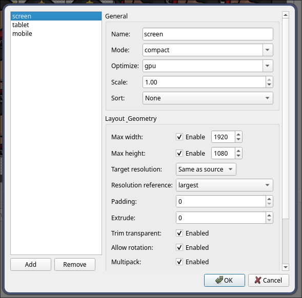
  - The layout canvas lists all frames; search the frame list by name to filter sprites for quicker edits.
  - 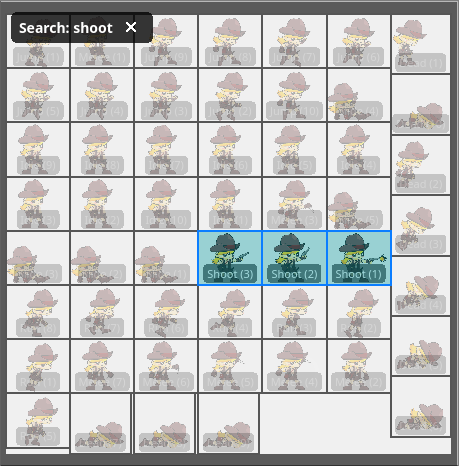
  - Adjust profile/padding/trim controls, zoom/scroll the canvas, and move the viewport with scrollbars or mouse drag. Clipboard cut/copy/paste works while managing frames.
  - 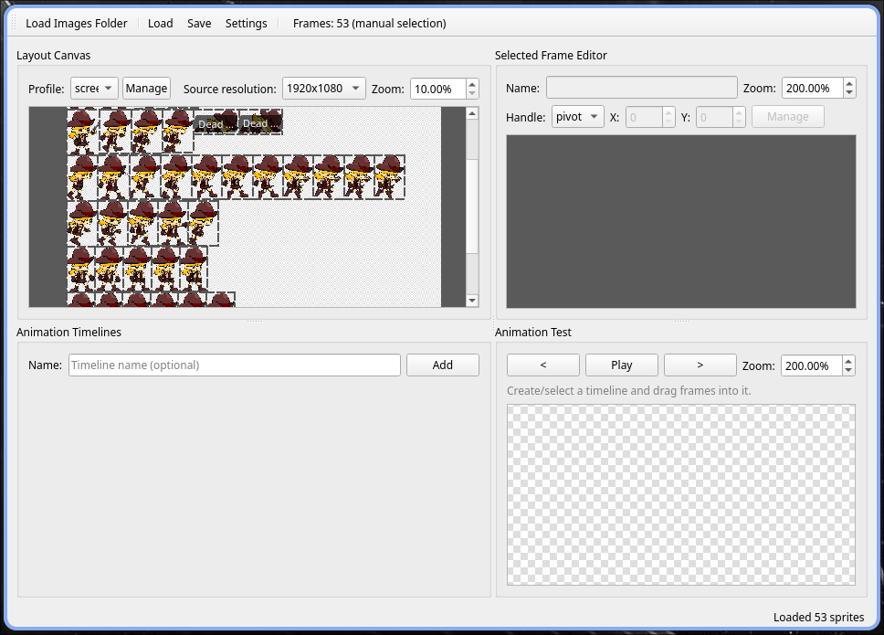

- **Frames detection**
  - When you drag and drop a single image file (like a sprite sheet or a strip), the app automatically runs `spratframes` to detect individual frames.
  - A dedicated dialog opens showing the identified frames. You can select exactly which ones to import.
  - 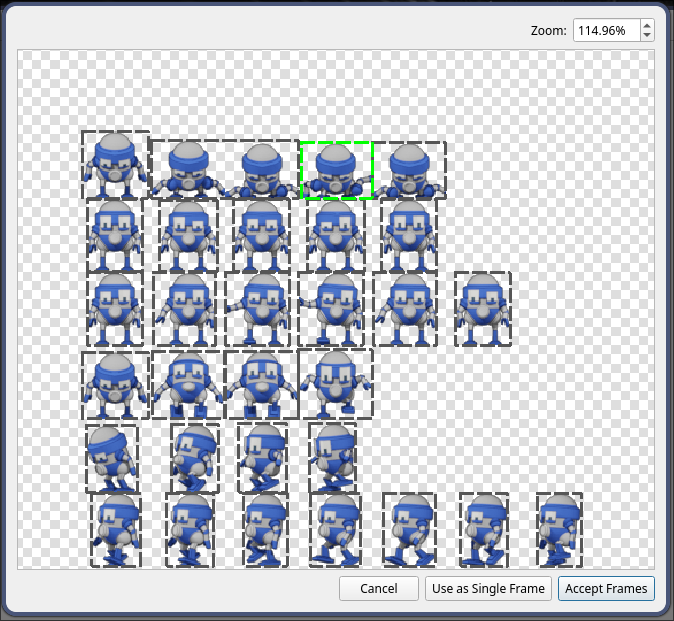
  - **Splitting frames**: If the automatic detection merges two or more frames, use the **Split Mode** (right-click a frame or use the toolbar in the detection dialog) to manually divide them.
  - 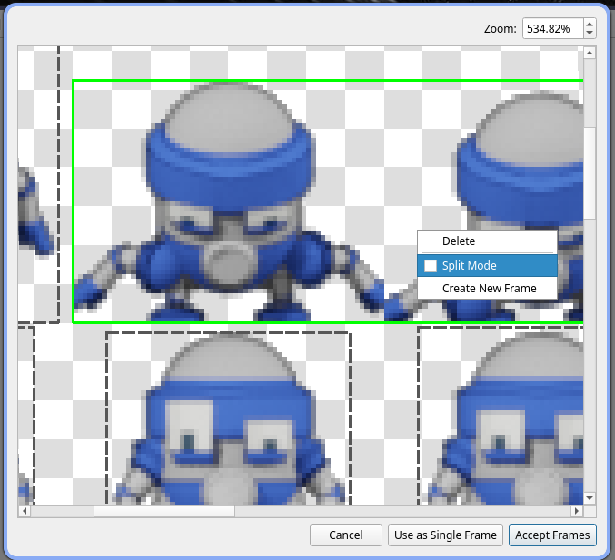
  - Click on a frame to place a splitting line; the view supports zoom for exact placement (CTRL + mouse wheel).
  - 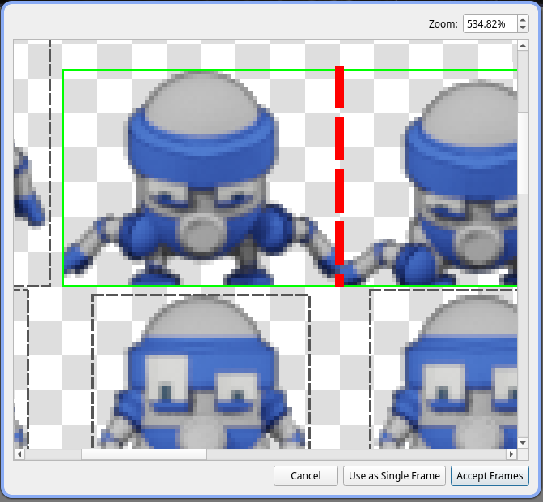
  - Once satisfied, accept the detection to extract and load the frames into your project.
  - 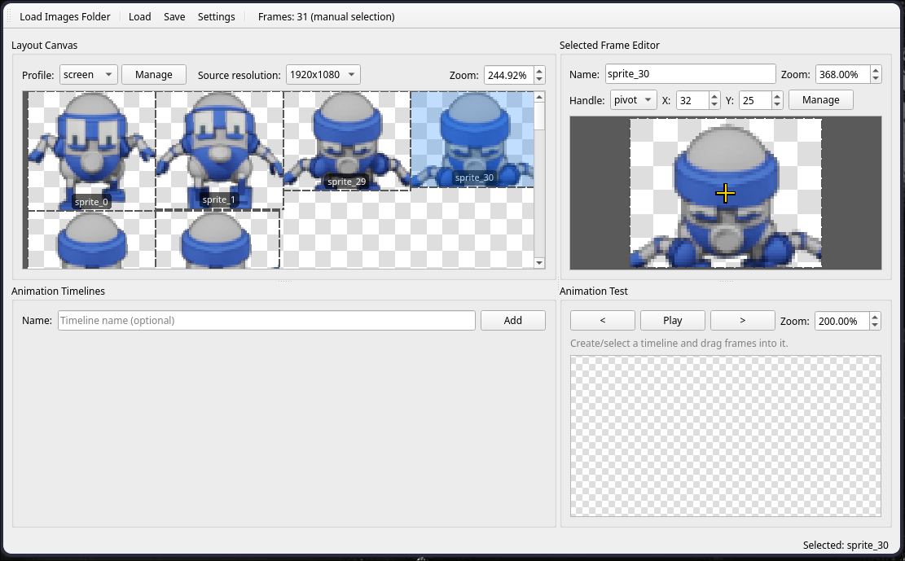

- **Sprite sheet layout editing**
  - Select a sprite to see its preview details; use zoom/scroll controls inside the preview canvas.
  - Rename the sprite, adjust its pivot (X/Y spins), or switch between markers (point/circle/rectangle/polygon) via the handle dropdown.
  - Markers show handles for precision; add/edit points, circles, rectangles, or polygons using the markers dialog and context menus—marker info is also copied to clipboard.
  - 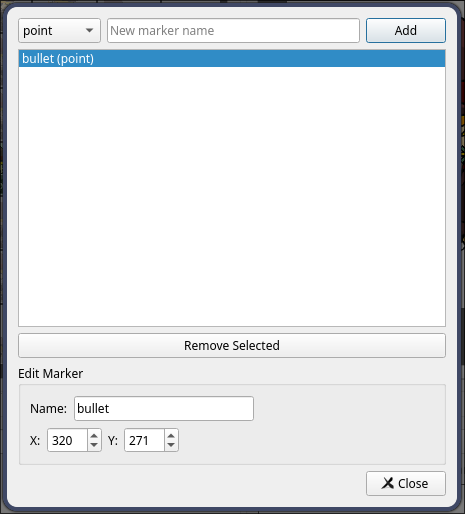
  - 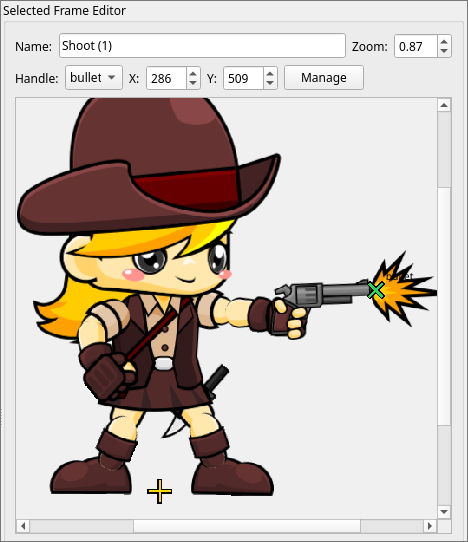
  - 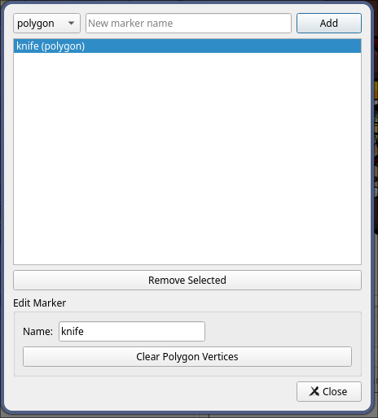
  - 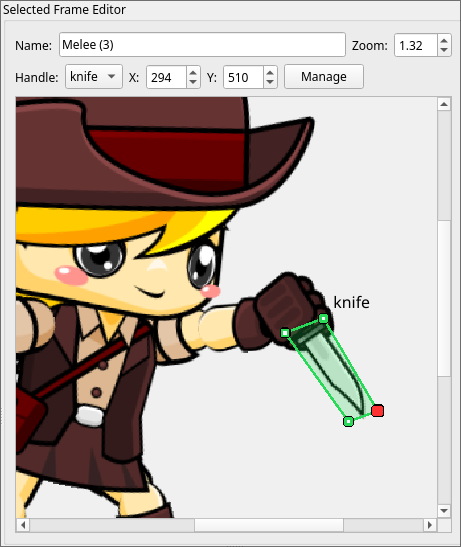
  - 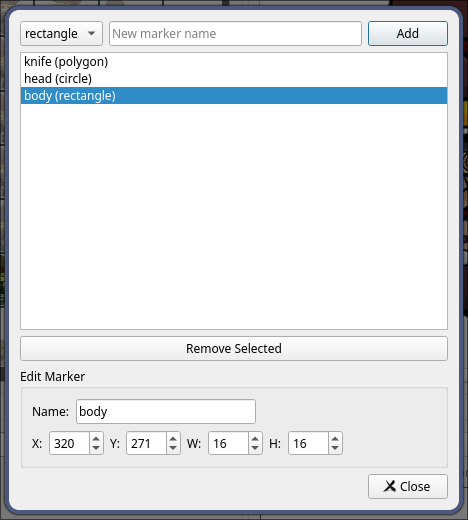
  - 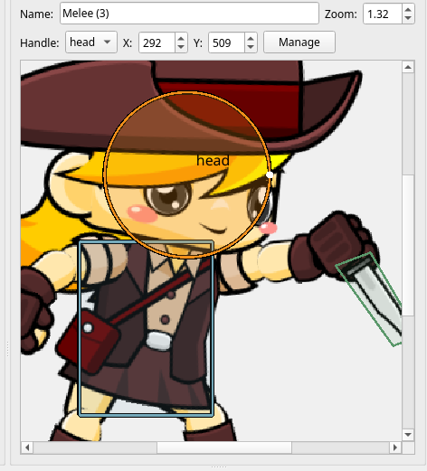
  - Right-click pivot/marker handles to open context actions, including **Apply to Selected Frames** (applies from the active source sprite to the current multi-selection in the layout canvas).
  - 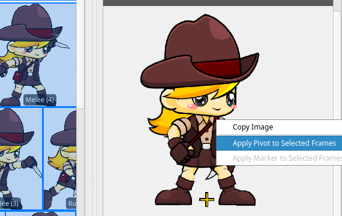

- **Animation authoring**
  - Timelines panel lists all animations with detailed info: `<name> | <frames count> frames | <fps> fps`.
  - List items display an icon preview using the middle frame of the sequence.
  - The **Selected Timeline** group provides controls to rename, adjust FPS, and manage the frame sequence ("tape").
  - Drag frames from the layout into the timeline; reorder via drag-and-drop or context actions; duplicate/remove frames with toolbar buttons.
  - Animation test area exposes play/pause/step controls plus timeline FPS and zoom controls.
  - The animation test area auto-sizes to the widest/tallest frame in the current timeline, keeps frames fully visible, and uses scrollbars when content exceeds the viewport.
  - Animation test preview supports wheel scrolling, `Ctrl+Wheel` zoom, and panning (`Middle Mouse Drag` or `Space + Left Drag`).
  - Use “Save Animation…” (right-click preview) after choosing ImageMagick/FFmpeg toolchains.
  - 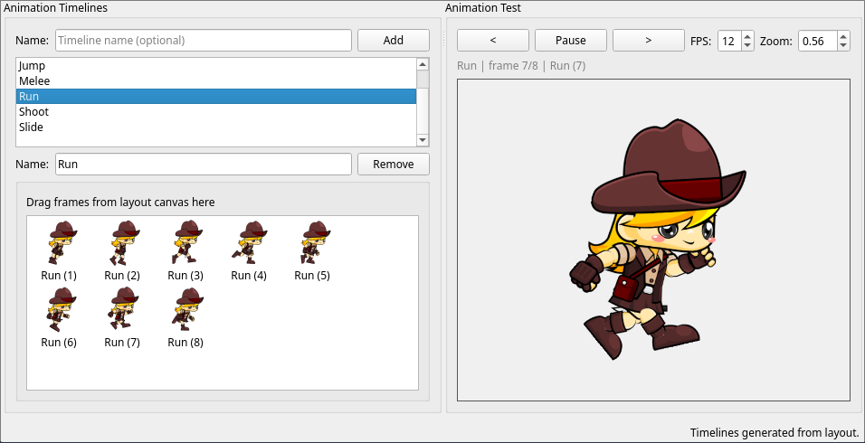

- **Sources management**
  - Open **Sources** (toolbar or menu) to view, rename, and manage all image sources in the project.
  - Each row shows the source type (folder, archive, image, or URL), its path, and two sync actions:
    - **Sync Source to Layout**: re-imports changes from the original file into the project. Disabled when no cached copy exists (e.g., folder sources used directly).
    - **Sync Layout to Source**: writes the current sprite state back to the original file — repacks archives, re-renders PNG atlases, or re-exports GIFs. A confirmation dialog shows a diff (files added / updated / deleted) before writing. Disabled for URL sources.
  - If the original file has been moved or deleted, the app offers to recreate it from the cached copy, embed the live layout sprites into a new file, locate it from the filesystem, or remove the source entirely.
  - If individual files are missing inside an existing source, the app offers to restore them from the project cache or locate a replacement folder.

- **Project save/load**
  - Save projects as `.json` or `.zip` and pick exactly which data blocks to persist.
  - Use load actions to resume layout, timelines, and editor context from a saved project.
  - **Autosave**: The application automatically saves a recovery snapshot of your project every 5 minutes. If the app is closed unexpectedly, it will offer to restore the autosaved state upon the next launch.
  - 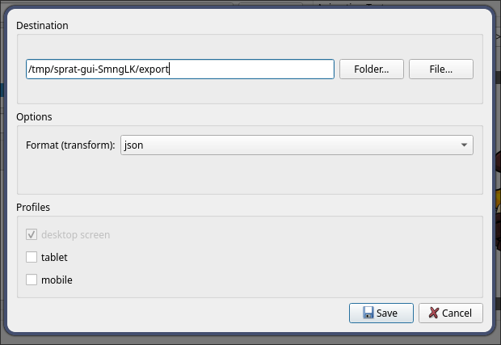

## Keyboard and pointer controls

### **General Application**
- `Ctrl + S`: Save project.
- `Ctrl + Z`: Undo (layout changes, pivot/marker edits, project state).
- `Ctrl + Y`: Redo.
- `Ctrl + V`: Paste / import image from clipboard.
- `Ctrl + +` / `Ctrl + =`: Zoom In.
- `Ctrl + -`: Zoom Out.
- `Ctrl + 1`: Reset zoom to 100%.
- `Ctrl + 0`: Fit to screen.

### **Atlas View**
- `Alt+L`: Switch to **Layout** view.
- `Alt+N`: Switch to **Navigation** view.

### **Navigation View (Sprite Navigator)**
- `Delete`: Remove selected sprites from the layout.

### **Navigation & Selection (Canvases / Lists)**
- `Space (Hold) + Mouse Drag`: Pan (move) the view.
- `Ctrl + A`: Select all items.
- `Arrow Keys`: Navigate selection.
- `Shift + Arrow Keys`: Extend selection while navigating.
- `Delete` / `Backspace`: Remove selected items.

### **Layout Canvas**
- `Alt (Hold)`: Temporarily enable **Split Mode**.
- `Any Printable Character`: Start searching for sprites by name.
- `Backspace`: Delete last character of search query.
- `Escape`: Clear search query.
- `Home` / `End`: Jump to the first / last frame in the current row.

### **Selected Frame Editor (Preview)**
- `Right Click` on pivot/marker: Opens context actions.
- `Delete` / `Backspace`: Remove selected polygon vertex or marker.
- `Ctrl + Wheel`: Zoom preview.
- `Space + Drag` or `Middle Mouse Drag`: Pan preview.

### **Animation Test Preview**
- `Wheel`: Scroll preview viewport.
- `Ctrl + Wheel`: Change animation preview zoom.
- `Space + Left Drag` or `Middle Mouse Drag`: Pan preview.
- `Right Click`: Export/copy frame menu.

### **Frame Detection Dialog**
- `Alt (Hold)`: Temporarily enable **Split Mode**.
- `Delete` / `Backspace`: Delete selected detected frames.
- `Ctrl + 1`: Zoom 100%.
- `Ctrl + 0`: Zoom Fit.
- `Ctrl + Mouse Wheel`: Zoom at mouse position.

### **Animation Timeline List**
- `Delete` / `Backspace`: Remove selected timeline(s).
- `Ctrl + A`: Select all timelines.

## Timeline auto-generation naming

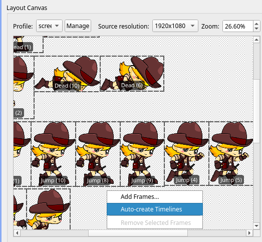 

Supported patterns:

```text
<Name> (<Index>)
<Name> [<Index>]
<Name>_<Index>
<Name> <Index>
<Name>-<Index>
<Name><Index>
```

Examples:

- `Idle (0)`, `Idle (001)`, `Idle [2]`
- `Run_0`, `Run 01`, `Run-2`, `Punch3`

Generation behavior:

- Creates timeline `<Name>` if it does not exist.
- Adds frames whose names end with a numeric index in one of the supported patterns.
- Sorts frames by `<Index>`.
- If a timeline exists, you can choose **Replace**, **Merge**, or **Ignore**.

## Project structure (high-level)

- `src/App/MainWindow/` — UI composition and event delegation
- `src/SpriteSheetLayout/` — layout canvas/parser/sprite model UI item
- `src/SelectedSpriteFrame/` — selected-frame preview/overlay/markers flow
- `src/Animation/` — animation playback/export logic
- `src/Animation/Timelines/` — timeline building and operations
- `src/Project/` — project load/save/payload/autosave
- `src/CLITools/` — CLI discovery/config/install helpers
- `src/Settings/` — settings dialog/coordinator
- `src/Core/` — shared models

## Troubleshooting

- **”CLI missing” at startup**
  The app will prompt you to install them automatically. Alternatively, open **Settings → CLI Tools** and set absolute paths for your own Sprat binaries.

- **Cannot save/load `.zip` project**
  ZIP handling is built in via libarchive. If saving still fails, check that the destination path is writable and that sufficient disk space is available.

- **Animation export disabled or failing**
  Install ImageMagick and/or FFmpeg, then restart the app.

- **Translations are not generated during build**
  Install `Qt6 LinguistTools`. Without it, the app still builds, but automatic `.ts/.qm` generation is skipped.

## WASM Limitations

The web version shares most functionality with the desktop build. The following constraints apply:

- **Frame detection and animation export unavailable**
  `spratframes`, ImageMagick, and FFmpeg are not available in the browser environment. Use the desktop version for GIF/video export or automatic frame detection.

- **File access via picker only**
  The browser sandbox restricts direct filesystem access; use the **Load Images Folder** button or drag-and-drop files from your local machine.

## Contributing

- **Report bugs**  
  Open an issue with reproduction steps, expected behavior, actual behavior, OS, and logs/screenshots when available.

- **Suggestions / feature requests**  
  Open an issue describing the workflow problem first, then proposed behavior and tradeoffs.

- **Pull requests**  
  PRs are welcome. Keep changes focused, include rationale, and add tests or manual validation notes for behavior changes.

- **Translations (Qt)**  
  User-facing GUI strings should use Qt translation APIs (`tr(...)` in `QObject` classes, `QCoreApplication::translate(...)` in non-`QObject` code). Translation catalogs live in `i18n/`:
  - `i18n/sprat-gui_en.ts`
  Typical workflow:
  1. Update code strings using `tr`/`translate`.
  2. Run `lupdate` to refresh `.ts` entries.
  3. Translate in Qt Linguist.
  4. Run `lrelease` to generate `.qm` files.
  5. Verify by launching with a target locale (the app auto-loads `sprat-gui_<locale>.qm` from `./i18n` or the app directory).
  Note: if `Qt6LinguistTools` is not installed, CMake still builds the app but skips automatic `.ts/.qm` generation.

- **Packages / binaries**  
  Contributions for distribution packages and CI release flows are welcome, including:
  - Debian/Ubuntu (`.deb`)
  - RPM-based distros (`.rpm`)
  - Windows binaries/installers
  - macOS app/bundles

- **Forks / alternative frontends**  
  Forks are encouraged (for example, a GTK+ frontend variant) as long as they clearly document compatibility and maintenance scope.

- **AI-assisted work**
  Development on this project has been assisted with Codex, Gemini, and Claude Code; all changes are reviewed and manually adjusted since AI output is not perfect.

## Attribution

- Screenshots using the “Adventurer Girl – Free Sprite” pack by pzUGH from OpenGameArt (https://opengameart.org/content/adventurer-girl-free-sprite), reused under the original license.
- Core CLI tooling comes from the [`sprat-cli`](https://github.com/pedroac/sprat-cli) repository.

## License

MIT. See [LICENSE](LICENSE).

## Support

[](https://buymeacoffee.com/pedroac)
